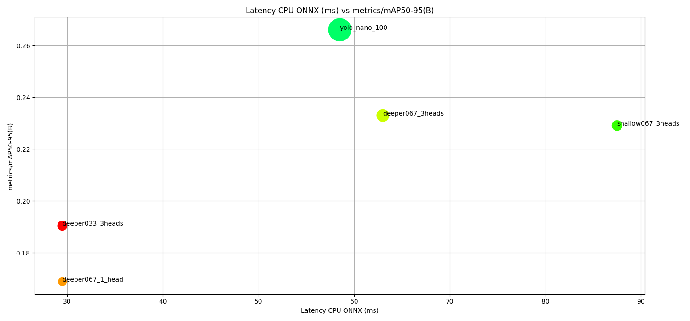

## Object detection

This object detection recipe is heavily based and depends on YOLO v8, developed by [Ultralytics](https://github.com/ultralytics/ultralytics)
It supports training and inference, for now, tested on the COCO dataset.

To reproduce our results, you can follow these steps:

1. install PhiNets with `pip install git+https://github.com/fpaissan/micromind` or `pip install -e .` (in the root folder)
2. install the additional dependencies for this recipe with `pip install -r extra_requirements.txt`
3. launch the training script on the dataset you want

### Run the code

``` bash
./launch_training.sh
```

which in turn is just a command that launches the following program:

``` python
python detection.py
```

For now, everything has to be changed inside the detection.py code. We are working on a more user-friendly interface.

### Dataset

Note the dataset has to be downloaded, so it is recommended to have the dataset already installed and in a known location and accessible from the code.

### Benchmark

Comparison between accuracy, number of parameters and mAP. ONNX test on CPU.
The size of the dot indicates the size of the model in MB.

In the table is a list of PhiNet's performance on some common image classification benchmarks.
The architecture was made of the backbone with PhiNet. Also, the detection head was modified to substitute the C2f layers with PhiNetConvBlock layers.



| Dataset | Model arguments                                                                               | mAP50  | latency (ms) | size (MB) | layers  | parameters | GFLOPS  |
| ------- | --------------------------------------------------------------------------------------------- | ------ | ------------ | --------- | ------- | ---------- | ------- |
| COCO-80 | `PhiNet(alpha=0.67, beta=1, t_zero=4, num_layers=6)`                                          | 0.2561 | 114.75       | 2.7       | 178     | 573787     | 10.3    |
| COCO-80 | `PhiNet(alpha=0.33, beta=1, t_zero=4, num_layers=7, num_heads=3)`                             | 0.1904 | 30.51        | 2.1       | 189     | 528467     | 2.6     |
| COCO-80 | `PhiNet(alpha=0.67, beta=1, t_zero=4, num_layers=7 num_heads=3)`                              | 0.2330 | 43.25        | 3.5       | 189     | 891099     | 4.2     |
| COCO-80 | `PhiNet(alpha=1, beta=1, t_zero=4, num_layers=7, num_heads=3)`                                | 0.1904 | 30.51        | 3.5       | waiting | waiting    | waiting |
| COCO-80 | `PhiNet(alpha=0.67, beta=1, t_zero=4, num_layers=7, num_heads=1)`                             | 0.1688 | 32.49        | 1.6       | 152     | 403803     | 2.0     |
| COCO-80 | `PhiNet(alpha=0.67, beta=1, t_zero=4, num_layers=7, num_heads=3) + C2f in the detection head` | 0.1688 | 32.49        | 1.6       | waiting | waiting    | waiting |

### Yolo Original

Here instead the detection head was kept in the original way.


| Dataset | Model arguments                                                   | mAP50  | latency (ms) | size (MB) |
| ------- | ----------------------------------------------------------------- | ------ | ------------ | --------- |
| COCO-80 | `PhiNet(alpha=0.67, beta=1, t_zero=4, num_layers=6)`              | 0.2561 | 114.75       | 2.7       |
| COCO-80 | `PhiNet(alpha=0.33, beta=1, t_zero=4, num_layers=7, num_heads=3)` | 0.1904 | 30.51        | 2.1       |

### Full Example

The following example is a complete example for training, exporting and doing inference using YOLO with a custom backbone powered by the PhiNet architecture.

#### 1 - Training

As mentioned above the first step involves tuning the parameters of the neural net and choosing the number of heads. Then we can just start training with the hyperparameter of our choice and let the algorithm train.

The resulting weights will be in pytorch format and they are usually saved in the ```./runs/detect/train/weights/best.pt```

At this point, the ```bench.py``` file can be used for a quick evaluation of the model. The script generates a log file, with all the most important
evaluation values.

#### 2 - Export

The generated weights file is in pytorch format. In order to make it run efficiently on micro-controller such as Raspberry or STM32 hardware, it needs to be exported in different formats such as ```ONNX``` and ```tflite```.

In the current folder a script ```export.py``` is also available for exporting in many different formats supported by Yolo.

Set the correct path location of the ```.pt``` file. And modify the parameters for exporting.

``` python
export_filename = model.export(
    imgsz=160, format="tflite", half=True, int8=True, device="cpu"
)
```

The code above exports the network in the chosen format with all the set arguments.
**NOTE**: it is advised to export the model in the ```tflite``` format.
The exported file is usually generated in the same folder as the original file.

#### 3 - Inference

As last step, using the file in ```./inference_raspberry/lite_inference_compact.py```, the inference step can be easily done on a raspberry Pi in a few steps.

- Double check if all the extra-requirements have been correctly installed.
- Change the file location of the ```tflite``` weights file.
- Adjust the ```SCORE_THRESHOLD``` parameter based on the quantization of your model.
- Launch the command ```python lite_inference_compact.py```
- If you are running it on a raspberry, remember to add the ```DISPLAY:=0 python lite_inference_compact.py``` to launch the program on the right display.

### Cite PhiNets
```
@article{10.1145/3510832,
	author = {Paissan, Francesco and Ancilotto, Alberto and Farella, Elisabetta},
	title = {PhiNets: A Scalable Backbone for Low-Power AI at the Edge},
	year = {2022},
	publisher = {Association for Computing Machinery},
	address = {New York, NY, USA},
	url = {https://doi.org/10.1145/3510832},
	doi = {10.1145/3510832},
	journal = {ACM Trans. Embed. Comput. Syst.},
}
```
